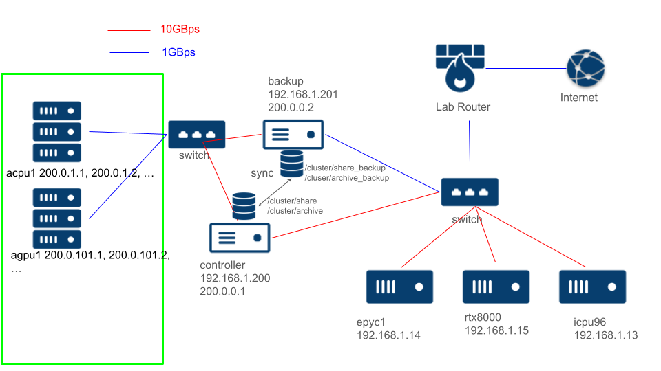

# あらまし
計算クラスタ（Computing Cluster）は，複数のコンピュータ（ノード）をネットワークで接続し，一つのシステムとして運用する技術である．これにより，大規模な計算タスクやデータ処理を効率的に実行することができる．本稿では，研究室にあるクラスタについて説明するとともに，タスクの実行方法・クラスタの構築方法について説明する．

# 一般論
## 構成
計算クラスターは、以下の主要なコンポーネントから構成される．
1. ノード(Node): 計算クラスターを構成する個々のコンピュータ．
    - ヘッドノード(Head Node, controller): ユーザーがログインし，ジョブを投入するためのノード．ジョブスケジューラや管理ソフトウェアが動作する．
    - 計算ノード（Compute Node）: 実際の計算タスクを実行するノード．ヘッドノードから指示を受けて計算を行う．
2. ネットワーク(Network): ノード間を接続する高速ネットワーク
    - スイッチ (Switch): ノードには普通せいぜい2つのネットワークインターフェイスしか無い．
    - プロトコル
        - イーサネット（Ethernet）: 一般的なネットワーク技術．典型的には1Gbits/sから400Gbits/sの速度がある．
        - InfiniBand: 低遅延・高帯域幅のネットワーク技術で，高性能計算クラスターでよく使用される．
3. ストレージ（Storage）: 計算データやプログラムを保存するための大容量ストレージシステム．
    - ローカルストレージ: 各ノードに直接接続されたストレージ
    - 共有ストレージ: ネットワーク経由でアクセス可能なストレージ．NFSやLustreなどのファイルシステムが使用される．
4. ジョブスケジューラ（Job Scheduler）: 計算リソースを効率的に管理し，ユーザーが投入したジョブを適切なノードに割り当てるソフトウェア．
    - Slurm: 広く使用されているオープンソースジョブスケジューラ
    - PBS: もう一つの一般的なジョブスケジューラ
5. 複数ノード協調計算技術：複数ノード協調計算技術は，計算クラスター内の複数のノードが協力して一つの計算タスクを実行するための技術です．これにより，単一のノードでは処理できない大規模な計算を効率的に実行できる．基本的に高速なネットワークが前提である．
    - MPI（Message Passing Interface）：複数ノード間でメッセージをやり取りし，並列計算を行うための標準的なライブラリである．各ノードが独立して計算を行い，必要に応じて他のノードとデータを交換する．
    - MapReduce：大規模なデータセットを分散処理するためのプログラミングモデルである．複数ノード間でデータを分割し，各ノードが独立して処理を行い，最終的に結果を統合する．HadoopやSparkなどのフレームワークで実装されている．

## 計算クラスタの利点
1. 高性能計算: 複数のノードを並列に使用することで，単一のコンピュータでは不可能な大規模な計算を実行できる．
2. リソースの効率的な利用: ジョブスケジューラにより，計算リソースを効率的に利用できる．
3. 拡張性: 必要に応じてノードを追加することで，システムの性能を簡単に拡張できる．

# 研究室のクラスタ(cluster)
## 構成


図1にクラスタの構成図を示す．(TODO)放置している間にサーバーのOSが変わったりしたので再構築する
1. ノード
    - ヘッドノード
    controllerがヘッドノードである．controllerはヘッドノードであるほか，緑枠で囲った計算ノードたちをインターネットにつなげるためのルーターとしても機能する．また，共有ストレージ(/archive, /share)のサーバーの役目もある．16コア32スレッドのCPUを持つが，コントローラやファイル共有サーバとしても機能するので，クラスタでは12コア24スレッドのCPUとして扱い，計算中も余裕を持たせる．
    - ヘッドノード(バックアップ)
    backupはcontrollerに問題が生じたときのためのバックアップノードである．ジョブスケジューラ自体のバックアップを行うとともに，controllerの共有ストレージを定期的にバックアップする．　　
    - 計算ノード (緑枠内)
    緑枠内の計算ノードはこのクラスタ専属のコンピュータである．基本はAMD Ryzen 9 3900Xか3950XをCPUとするコンピュータである．CPUのみ(acpu1-1 ~ acpu1-6)，GPU2枚(agpu1-1 ~ agpu1-6)2種類がある．クラスタが計算を行わないときにはシャットダウンし，計算を開始するときにはcontrollerがwake on lanによって起動させる((TODO)スイッチにMACアドレスを保存する期限を無期限にする設定ができずに躓いたのを解決したのだが文書がどこかに行ったので改めて文書化する)．
    - 計算ノード(サーバ)
    epyc1，p100，rx8000はそれぞれ高速計算サーバーであり，クラスタ外の用途にも使うので，場合によってはクラスタから一時的に切り離したり，これらを含まないパーティション(slurmの機能，後述)で計算を動かすなどする．
2. ネットワーク
    1Gb/s および10Gb/s のイーサネットネットワークを用いている．高度なノード間協調計算をするには遅すぎるので，基本的には考えないこと．図1の線の色(赤:10Gb/s，青:1Gb/s)で速度を表現している．  
    緑枠内部はcontrollerノードによって基本的にインターネットから切り離され，ソフトウェアのアップグレードの時などにはcontrollerがルーティング機能を有効化することでインターネットに接続する．controllerおよびbackupはepyc1，p100，rx8000からのみのssh接続を受け付ける．
3. ストレージ
    - 共有ストレージ
    controllerが持つ/shareおよび/archiveディレクトリはクラスタ内のすべてのコンピュータにNSF接続によって共有される．/shareには実行するプログラムや環境を配置し，/archiveには計算結果を保存する．  
    backupノードは/share_backupおよび/archive_backupというディレクトリを持ち，毎日午前0時に/shareと/archiveと同期する．
    - 個別ストレージ
    緑枠内の各ノードは500GBのSSDを持ち，中間計算結果を保存する．controller，backupも同様である．サーバーもそれぞれ個別のストレージを持っている．
4. ジョブスケジューラ  
slurm workload managerを用いる．
5. 複数ノード協調計算技術  
先述したとおり，ネットワークはたかだか10Gb/sなので，高度なノード協調計算は考えていない．ノード間のデータ共有頻度が低いようなら試してみても良い．

## ユーザー制御
普通linuxでは他の人のホームディレクトリは読み書きできないが，いろいろな都合で```/share, /archive```以下の全てのディレクトリは誰でも読み書きできる．非常に危険なので注意して扱い，バックアップも頻繁に取ること．LDAPを使うと全ノードでアカウントやグループのidを統一できて排他制御も楽になるらしい．

## タスクの実行方法
[FOCUSスパコン利用案内](https://www.j-focus.jp/user_guide/ug0004020000/)，[cluster_construction/5.execute_program.md](cluster_construction/5.execute_program.md) など参考のこと．

## 計算クラスタの構築
計算クラスタを1から作成する手順を記す．ノードを追加する手順についても記す．
### 計算クラスタ構築(virtual)
virtualboxの仮想環境で最低限の要素からなるクラスタを構築する．実際に行ってみれば勘がつかめると思う．(cluster_construction_virtual参照)

### (TODO)計算クラスタ構築(physical)
実際の手順は示さないが，slurmやNSFの設定ファイルをおいておく．(cluster_construction_physical参照)

### (TODO)計算ノード追加(physical)
*計算クラスタ構築(virtual)*と*計算クラスタ構築(physical)*を読めばほとんど明らかだろうが，時間がない人のために新たなノードを追加するときの手順を記す．