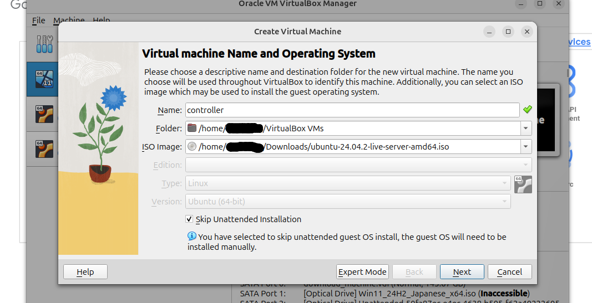
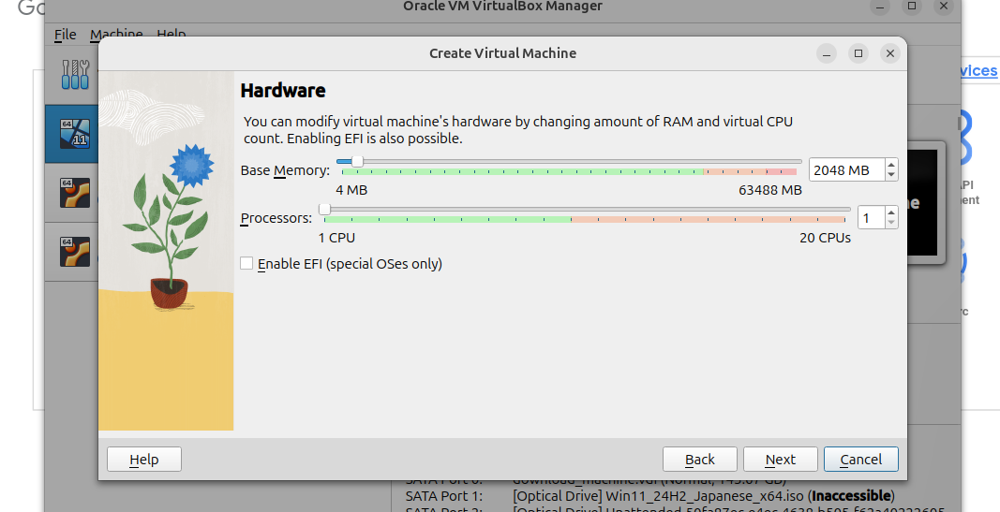
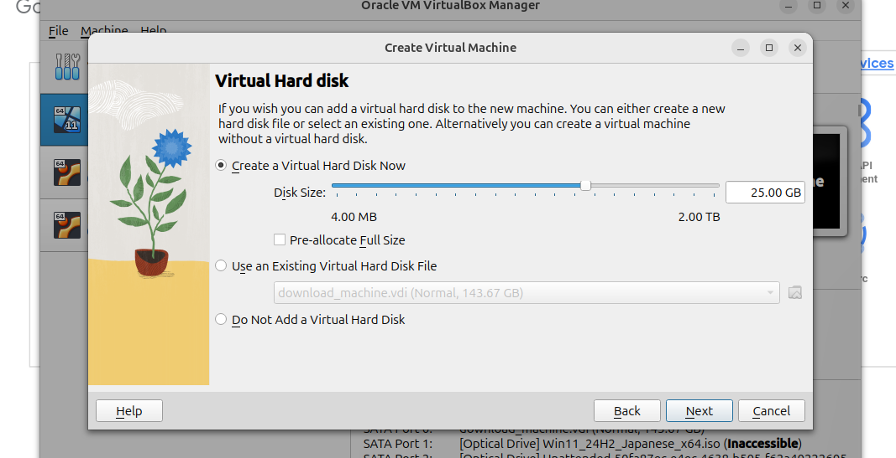
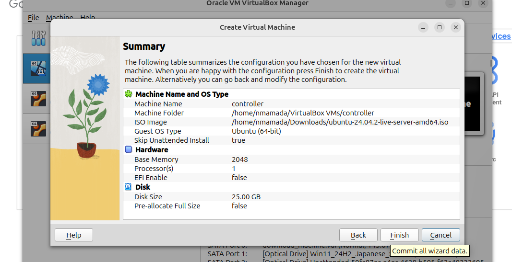

# controller設定
1. NewボタンからCreate Virtual Machineウィザードを起動．
2. ノード名，ubuntuのインストールイメージを指定．フォルダはデフォルト．skip unattended installationをチェックする．

3. ハードウェア設定．Processorsを2にする

4. ハードディスク設定．デフォルト

5. サマリープリント．Finish

6. ネットワーク設定
README.md.図1の通り，controllerは，ホストに向けて1つ，緑枠内に向けて1つの接続を持っている．この状態を表現するため，Setting/Networkから
- Adapter 1はBridge Adapterとして設定(Nameはデフォルト)
- Adapter 2はInternal Networkとして設定(Nameはデフォルト)  
と設定する．

# acpu1-1~acpu1-3設定
controller設定とほとんど同様だが，ノード名はacpu1-1，ネットワーク設定ではAdapter 1をInternal Network(Nameはデフォルト)として設定する．Adapter 2は設定しない．

# epyc1設定
controller設定とほとんど同様だが，ノード名はepyc1，processorsは3，ネットワーク設定ではAdapter 1をBridge Adapter(Nameはデフォルト)として設定する．Adapter 2は設定しない．