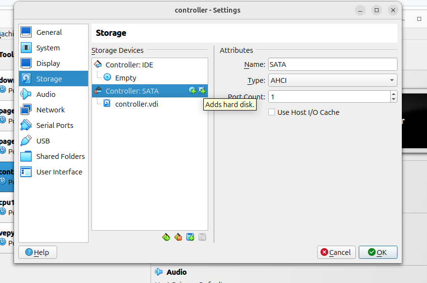
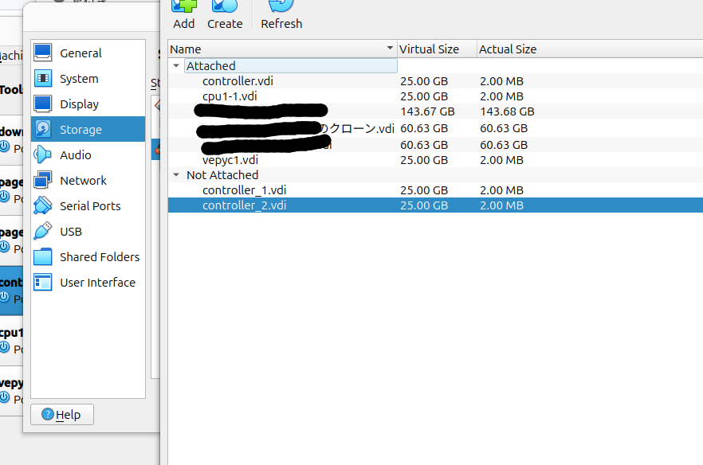
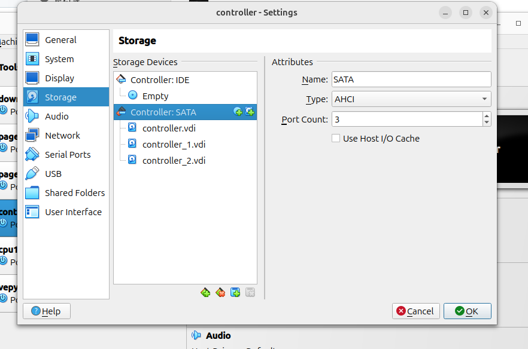
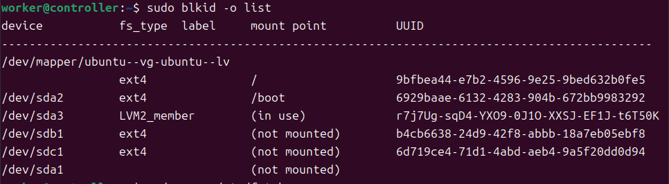

# ネットワーク設定
controllerはクラスタのネットワークにおいて
- クラスタ専用ノードのルーター
- 共有ストレージのホスト  
- パッケージマネージャのキャッシュサーバー

の役割を持つ．これらの設定を行う．

## Controllerにディスクを追加
/archive, /shareは本番環境ではそれぞれ別のディスクに保存する．仮想環境でもそれを再現するため，virtualboxの機能でcontrollerにディスクを追加する．

1. Settings-> Storage -> Controller:SATAのAdds hard diskボタンをクリック

2. Create Disk Image Fileをクリック

3. すべてデフォルトを選択
4. 作成されたディスクをchoose
4. 2~4をもう一度繰り返す
5. 以上の操作でcontroller_1.vdi,controller_2.vdiが新たにcontrollerに追加された．


## 準備
1. controllerを起動
2. ホストからworker@192.168.1.200でログイン．パスワードはworker
3. エディタのインストール． ```sudo apt update && sudo apt install nano```

## ルーター機能インストール
1. パケット転送を有効化  
```/etc/sysctl.conf```の```net.ipv4.ip_forward=1```をコメントアウトを解除  
```sudo sysctl -p```実行


## 共有ストレージのホスト設定
追加されたディスクを別々にマウントし，NSF機能によって計算ノードと共有する．
1. ディスクにパーティションを作成するプログラム```parted```をインストール```sudo apt install parted```

2. 追加されたディスクを/share，/archiveとしてマウント
    1.  ```lsblk```コマンドで追加したディスクの名前を見られる．通常ハードディスクを追加するとsdbとかsdcという名前になる．
    2. ```sudo parted -s /dev/sdb mklabel gpt mkpart primary ext4 0% 100%``` によってディスクにパーティションを作成する準備をする． 
    3. ```sudo mkfs.ext4 /dev/sdb1```によってext4でパーティションをフォーマット
    4. ```/dev/sdc```にも同様

    5. マウント先のディレクトリを作成  
    ```
    sudo mkdir /archive && sudo chmod 777 -R /archive && sudo chown -R nobody:nogroup /archive
    sudo mkdir /share && sudo chmod 777 -R /share && sudo chown -R nobody:nogroup /share
    ```
    6. 作成されたパーティションのuuidを取得  
    ```sudo blkid -o list```を実行することで今作成したパーティションに割り振られるユニークなidであるUUIDを確認する．例えば画像では/dev/sbd1のuuidは```b4cb6638-24d9-42f8-abbb-18a7eb05ebf8```
    
    7. uuidをもとにパーティションをマウント  
    以下を```/etc/fstab```に追記することで，永続的にそれぞれのパーティションを/archive, /shareにマウントできる．
    ```
    /dev/disk/by-uuid/b4cb6638-24d9-42f8-abbb-18a7eb05ebf8 /archive ext4 defaults 0 1
    /dev/disk/by-uuid/6d719ce4-71d1-4abd-aeb4-9a5f20dd0d94 /share ext4 defaults 0 1
    ```

    ```sudo mount -a```によって編集内容を反映する．

3. NFS設定
    1. NSFサーバーインストール  
    ```sudo apt install nfs-kernel-server```
    2. NSFサーバー設定
    ```/etc/exports```に以下を追記
    ```
    /archive 200.0.0.0/16(rw,async,root_squash,no_subtree_check) 192.168.1.0/24(rw,async,root_squash,no_subtree_check)
    /share 200.0.0.0/16(rw,async,root_squash,no_subtree_check) 192.168.1.0/24(rw,async,root_squash,no_subtree_check)
    ```
    3. 設定を反映
    ```
    sudo exportfs -ra
    sudo systemctl restart nfs-kernel-server
    ```

## パッケージマネージャのキャッシュサーバー設定
1. なにそれ  
ubuntuでは主に```apt install```によってインターネットからパッケージをダウンロードしてインストールする．クラスタでは全てのノードが同じパッケージを用いる(用いたい)から，すべてのクラスタで同じパッケージをインストールするときにいちいち全ノード分をダウンロードするより，クラスタ内のあるノード(キャッシュサーバー)で一度ダウンロードし，他のノードはキャッシュサーバーからパッケージを取ってくるのが早い．この機能をcontrollerに設定する．

2. インストールと有効化
```
sudo apt install -y apt-cacher-ng
# 途中でAllow HTTP tunnels through Apt-Cacher NG?と問われる．yes
sudo systemctl enable --now apt-cacher-ng
```


3. https透過
```/etc/apt-cacher-ng/acng.conf```に  
```PassThroughPattern: .*``` を追記

## ルーター・ファイヤーウォール設定
controllerのファイヤーウォールに求められるふるまいは以下の通り．

### epn0s3
- 192.168.1.1との通信はポート80, 443, 53, 123のみを許可する(sshは許可しない)
- 192.168.1.14, 192.168.1.15, 192.168.1.171とのあらゆる通信を許可する

### enp0s8
- 200.0.0.0/16に対してルーティングを行い，LAN内部の全てのデバイスがインターネットに接続できるようにするが，200.0.0.0/16以外からのssh接続は拒否する
- 200.0.0.0/16内部でのあらゆる通信を許可する

これらを```ufw```で実現するため，以下を実行する．

1. フォワードポリシー有効化
    ```/etc/default/ufw```で
    ```
    DEFAULT_FORWARD_POLICY="DROP"
    ```
    という行を
    ```
    DEFAULT_FORWARD_POLICY="ACCEPT"
    ```
    に変更

2. マスカレード設定
    ```/etc/ufw/before.rules```の一番下に以下を追記
    ```
    # NAT 設定
    *nat
    :POSTROUTING ACCEPT [0:0]
    # enp0s3 が外部インターネットに接続するインターフェース
    -A POSTROUTING -o enp0s3 -j MASQUERADE
    COMMIT
    ```

3. ファイヤーウォール設定

```
# 192.168.1.1/24との通信はインターネット接続に関わるポートだけ許可
# だからローカル(virtualboxを動作させているコンピュータ)からはcontrollerにはssh接続できない
ufw allow in on enp0s3 from 192.168.1.1 to any port 80
ufw allow in on enp0s3 from 192.168.1.1 to any port 443
ufw allow in on enp0s3 from 192.168.1.1 to any port 53
ufw allow in on enp0s3 from 192.168.1.1 to any port 123

# 192.168.1.14, 192.168.1.15, 192.168.1.171との通信を全て許可
ufw allow in on enp0s3 from 192.168.1.14
ufw allow in on enp0s3 from 192.168.1.15
ufw allow in on enp0s3 from 192.168.1.171

# 200.0.0.0/16からのSSH接続を許可
ufw allow in on enp0s8 from 200.0.0.0/16 to any port 22

# 200.0.0.0/16以外からのSSH接続を拒否
ufw deny in on enp0s8 from any to any port 22


# 200.0.0.0/16に対してルーティングを許可
ufw route allow in on enp0s3 out on enp0s8 from 200.0.0.0/16 to any

# 200.0.0.0/16内部での通信を全て許可
ufw allow in on enp0s8 from 200.0.0.0/16 to any
```


```sudo systemctl enable ufw```で```ufw```を再起動時に起動するようにする．  
```sudo ufw enable```で```ufw```を今のセッションで起動する．

**この状態でsshからログアウトすると，epyc1からしかcontrollerにssh接続できなくなる．その場合はvirtualboxのコンソールから```sudo ufw disable```でufwを一旦無効化するか，epyc1をインストールしてそれを踏み台にしてcontrollerにssh接続する**


## 専属ノードとのssh設定
epyc1からcontrollerへ，controllerから200.0.0.0/16へのssh接続はsrc/id_ed25519を使う．epyc1のユーザーは皆workerとしてcontrollerにssh接続する．

### epyc1からcontroller

1. controllerにepyc1からssh公開鍵をコピー
```ssh-copy-id -i src/id_ed25519.pub controller```

2. src/id_ed25519をepyc1の.ssh/以下にコピー
3. epyc1の```.ssh/config```に以下を追記
```
Host controller
    User worker
    IdentityFile ~/.ssh/id_ed25519
```

### controllerから200.0.0.0/16

200.0.0.0/16には公開鍵がすでに登録されており，```src/id_ed25519.pub```が秘密鍵なので，これを```.ssh/```以下にコピーする． さらに
```.ssh/config```に以下を追記
```
Host 200.0.100.1
    StrictHostKeyChecking no
    UserKnownHostsFile /dev/null
```

**(読まなくても良い)** この設定は200.0.100.1の接続相手が前と異なると警告を出す機能を無効化する．自動インストール([詳細](./appendix1.autoinstaller.md))では，新たなノードにubuntuをインストールする時は200.0.100.1をipアドレスとして与え，その後の詳細設定で適切なipアドレスに再設定する．そのため，クラスタ構築の過程では200.0.100.1は入れ替わり，先述の警告が必ず生じて不便なので，無効化する．  
この警告機能自体は，いつも接続しているデバイスが攻撃者のなりすましにすりかわっているときに接続を回避できるため有用であり，安全と分かっている時以外は有効にすべきである．