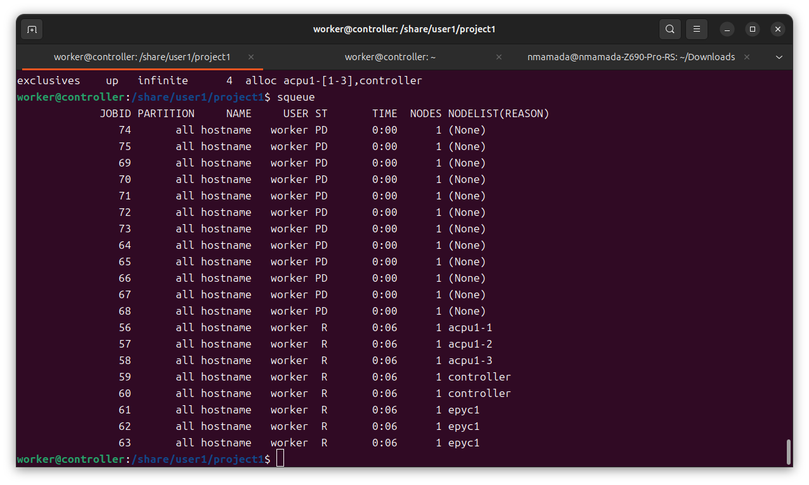

# 準備

- slurmが正常に動いていることの確認
```sinfo```で以下のような感じになっていれば成功．
```
PARTITION  AVAIL  TIMELIMIT  NODES  STATE NODELIST
all*          up   infinite      5   idle acpu1-[1-3],controller,epyc1
exclusives    up   infinite      4   idle acpu1-[1-3],controller
```

- アウトプットディレクトリ作成
```
mkdir -p /archive/controller/resutls /archive/controller/logs/out /archive/controller/logs/err

```
によって，プログラム実行による
- 正常系の結果
- 正常系のログ
- 異常系のログ

を書き出すディレクトリを作成する．

- プログラムディレクトリ作成  
```src/share/user1, src/archive/user1```をそれぞれ```/share/user1, /archive/user1```にコピー


# サンプルスクリプト

controllerノードで```sbatch sample.sh``` を実行することで，ジョブをslurmに登録する．

## 単純なbash
### コアごとの実行

```

#!/bin/bash
#SBATCH --job-name hostname
#SBATCH --output /archive/user1/project2/logs/out/%x-%j.log
#SBATCH --error  /archive/user1/project2/logs/err/%x-%j.err
#SBATCH --cpus-per-task 1
#SBATCH --time 00:15
#SBATCH --partition all
sleep 15
hostname_=$(hostname)
echo ${hostname_} >> /archive/user1/project2/hostnames

```

```sample.sh```はbashスクリプトなので```#```はコメントアウトの記号なのだが，先頭が```#SBATCH```である行はslurmが```sbatch```実行のオプションを表す文字列として解釈する．例えば```#SBATCH --job-name hostname```という行は```--job-name hostname```というオプションをsbatchコマンドに与えている．  

```sample.sh```の各行の意味は以下のとおりである．
1. #!/bin/bash  
このスクリプトが Bash で実行されることを指定する「シバン（shebang）」行．

2. #SBATCH --job-name hostname

ジョブの名前を hostname に設定．
sbatch でジョブを投入したときに、この名前で識別される．

3. #SBATCH --output/archive/user1/project2/logs/out/%x-%j.log

標準出力（正常系ログ） を /archive/user1/project2/logs/out/%x-%j.log 以下に保存．
%x はジョブ名、%j はジョブIDに置き換えられる．
例: hostname-123456.log

4. #SBATCH --error /archive/user1/project2/logs/err/%x-%j.err

標準エラー出力（異常系ログ） を /archive/user1/project2/logs/err/%x-%j.err に保存．
%x-%j により、ジョブごとのエラーログが区別される．

5. #SBATCH --cpus-per-task 1

ジョブに割り当てる CPU コア数を 1 に設定．

6. #SBATCH --time 00:15

ジョブの最大実行時間 を 15分間に制限．
制限時間を超えるとジョブは強制終了される．

7. #SBATCH --partition all

ジョブを投入するパーティション を ```all``` に設定．
クラスタの管理者が定義した特定のノードグループでジョブを実行する．

8. sleep 15

15秒間スリープ し、ジョブの動作を遅延させる．

9. hostname_=$(hostname)

現在のノードのホスト名 を取得し、変数 hostname_ に保存．

10. echo ${hostname_} >> /archive/controller/results/hostnames

ホスト名を /archive/controller/results/hostnames に追記 する．
実行された計算ノードのホスト名を記録するために使用される．

20回```sbatch sample.sh```を実行することで以下のような結果が得られた．  
```
controller
controller
epyc1
epyc1
epyc1
acpu1-3
acpu1-2
acpu1-1
controller
acpu1-2
acpu1-3
(つづく)
```

### ジョブ実行のコア数指定


また，```squeue```コマンドによって投入した未完了のジョブの一覧を見ることができ，画像のように各ノードのコア数のぶんだけジョブが並列実行されているとわかる．

## pythonスクリプト
```rye```や```pipenv```によって```/share/user1/project2/```に仮想環境を作成し，その環境をノード間で共有してプログラムを実行する方法を示す．

```/share/user1/project2/```で```uv init --virtual```によって仮想環境を作成し，  
```uv add numpy```によって仮想環境にnumpyを追加した．  
```main.py```を

```
import sys

def main():
    print("sys.executable:", sys.executable)
    import numpy as np
    print("np.__file__: ", np.__file__)

if __name__ == "__main__":
    main()
```

とする．これを実行するとpythonの実行環境とnumpyの場所をプリントする．numpyが見えない環境では当然エラーが生じる．

さらに```main.py```を実行するためのシェルスクリプト```sample_success.sh```，```sample_error.sh```を以下に示す．違いは後者では```source /share/user1/project1/.venv/bin/activate```によって作成した仮想環境を有効化している点である．```sample_success.sh```は正常に完了し，
```
sys.executable: /share/user1/project1/.venv/bin/python3
np.__file__:  /share/user1/project1/.venv/lib/python3.12/site-packages/numpy/__init__.py
```
が```/archive/user1/project1/logs/out/hostname-19.log``` に出力されるはずである．

一方```sample_error.sh```は失敗し，結果は

```/archive/user1/project1/logs/out/hostname-30.log```:  
```sys.executable: /usr/bin/python3```

```/archive/user1/project1/logs/err/hostname-30.log```:  
```
Traceback (most recent call last):
  File "/share/user1/project1/main.py", line 9, in <module>
    main()
  File "/share/user1/project1/main.py", line 5, in main
    import numpy as np
ModuleNotFoundError: No module named 'numpy'
```

#### sample_success.sh
```
#!/bin/bash
#SBATCH --job-name hostname
#SBATCH --output /archive/user1/project1/logs/out/%x-%j.log
#SBATCH --error  /archive/user1/project1/logs/err/%x-%j.err
#SBATCH --cpus-per-task 1
#SBATCH --time 00:15
source /share/user1/project1/.venv/bin/activate
python3 /share/user1/project1/main.py
deactivate
```

#### sample_error.sh
```
#!/bin/bash
#SBATCH --job-name hostname
#SBATCH --output /archive/user1/project1/logs/out/%x-%j.log
#SBATCH --error  /archive/user1/project1/logs/err/%x-%j.err
#SBATCH --cpus-per-task 1
#SBATCH --time 00:15
# source /share/user1/project1/.venv/bin/activate
python3 /share/user1/project1/main.py
#deactivate
```


## クラスタのパーティション
```/etc/slurm/slurm.conf```の最後の方に記述した
```
PartitionName=all Nodes=ALL Default=YES OverSubscribe=YES MaxTime=INFINITE State=UP
PartitionName=exclusives Nodes=controller,acpu1-[1-3] OverSubscribe=YES MaxTime=INFINITE State=UP
```
はクラスタの論理的な分割を示す．```all```ではepyc1も含めているが，epyc1が他に優先的な計算を行っている場合にはクラスタ専属ノードのみを使う```exclusives```パーティションを用いるなど便利な状況がある．他にもGPUを積んだノードは除くとか，GPUを積んだノードのみ使うとか考えられる．
その際には```sbatch```の引数であるスクリプトファイルに```#SBATCH --partition exclusives```と書くとか，```sbatch```のオプションに```--partition exclusives```を指定するなどすればよい．


## 補遺
pythonの仮想環境を共有ディレクトリ```/share```下に配置した一方，コンパイラ含めほかのプログラムは各ノードのローカルに保存されている．これはpythonの仮想環境は更新頻度が高いと見込まれ，更新時にいちいち全てのノードを更新するのが面倒だからである．全てのプログラムを共有ディレクトリに配置する構成も考えたのだが，ネットワークの速度が遅いので一旦諦めた．とはいえそういう構成のほうが楽なのは確かなので，のちのち考えること．ローカルディレクトリは計算途中を保存するだけに使うという考えもある．
