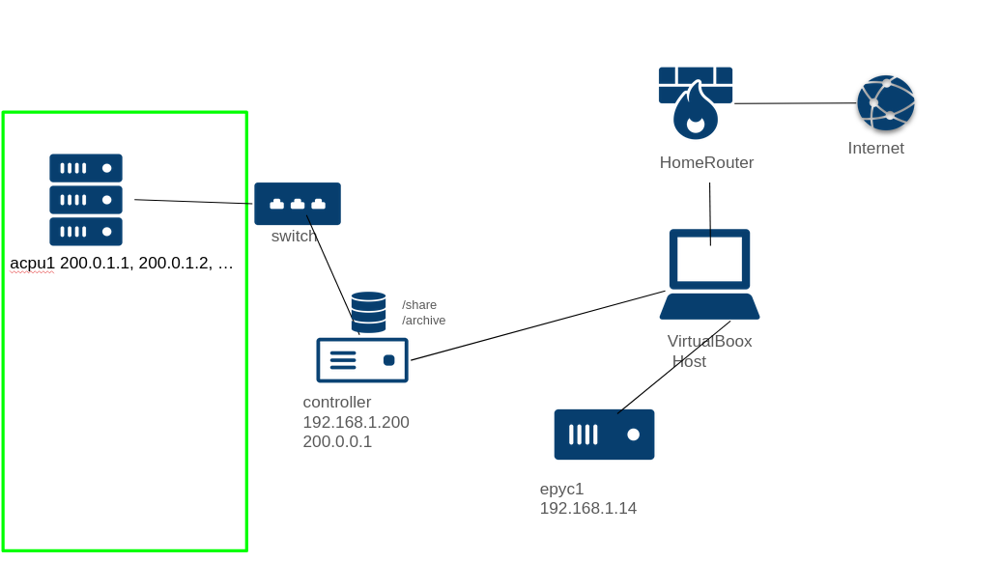

図1

図1に目標とする仮想クラスタのダイアグラムを示す．
virtualboxは仮想マシンおよび仮想マシン間のネットワークを構築するソフトウェアであり，実際のクラスタを操作する前にここで練習する．

virtualboxは適当にインストールし，最新のubuntu serverのイメージ(ここではubuntu-24.04.2-live-server-amd64.iso)を準備すること．

(注)ネットワークの設定は環境に依存する．特に，virtualboxを動作させているマシンの用いているipアドレスと，仮想マシンのipアドレス(192.168.1.200や192.168.1.14)が同じ場合にはどちらかを変更しなければならないし，ゲートウェイ(ルーターのipアドレス)はここでは192.168.1.1としたが，これも環境に応じて変更が必要である．